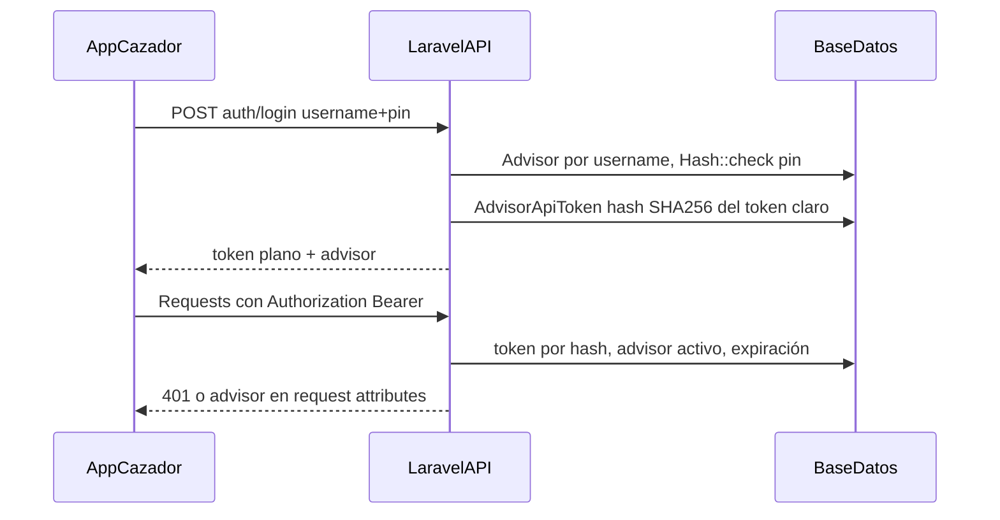

# Análisis detallado: API Cazador

Documento de referencia técnica (arquitectura, contrato y reglas de negocio). Para uso operativo del API, ver [API_CAZADOR.md](./API_CAZADOR.md).

## 1. Propósito y alcance

**Cazador** es el API REST para **asesores comerciales** (`Advisor`), no para usuarios web del CRM. Permite:

- Autenticarse con **usuario + PIN** (6 dígitos) y operar con **Bearer token** propio (no Laravel Sanctum sobre `users`).
- Gestionar **solo clientes propios** (tipo `PROPIO`), **tickets de atención**, **recordatorios** (también solo con clientes `PROPIO`), consultar **catálogo** de proyectos/lotes y crear **pre-reservas** con voucher.

La **aprobación** de pre-reservas y la **agenda** de tickets siguen en el panel **Inmopro** (web), como describe [API_CAZADOR.md](./API_CAZADOR.md).

---

## 2. Ubicación y prefijo real

- Rutas definidas en `routes/api.php` con prefijo de grupo `v1/cazador` y nombre `api.v1.cazador.*`.
- Las rutas de `api.php` llevan por defecto el prefijo **`/api`**, por lo que la base efectiva es:

**`/api/v1/cazador`**

---

## 3. Autenticación y middleware

- **Login:** `App\Http\Controllers\Api\v1\Cazador\AuthController`: valida `Advisor` por `username`, `is_active`, PIN con `Hash::check`, emite token vía `App\Models\Inmopro\AdvisorApiToken::issueFor` (80 caracteres aleatorios; en BD solo **SHA-256** del token).
- **Límite de peticiones:** la ruta `POST auth/login` usa el limitador **`cazador-login`** (intentos por minuto por IP). Tras superarlo, respuesta **429** Too Many Requests.
- **Rutas protegidas:** middleware alias `advisor.api` → `App\Http\Middleware\AuthenticateAdvisorApiToken`: exige `Bearer`, busca token hasheado, comprueba `expires_at` y `advisor.is_active`, actualiza `last_used_at`, inyecta `advisor` y `advisor_token` en `$request->attributes`.
- **Logout:** borra el registro del token actual (invalidación real).
- **401:** JSON `{ "message": "No autenticado." }` si falta token o es inválido.

**Seguridad:** el token en tránsito debe ir siempre por **HTTPS** en producción.

---

## 4. Mapa de endpoints (implementación vs documentación)

| Área          | Método y ruta (relativa a `/api/v1/cazador`) | Controlador               | Notas                                                   |
| ------------- | -------------------------------------------- | ------------------------- | ------------------------------------------------------- |
| Auth          | `POST auth/login`                            | AuthController            | 422 credenciales inválidas; throttle por IP             |
| Auth          | `POST auth/logout`                           | AuthController            | Requiere Bearer                                         |
| Perfil        | `GET me`                                     | ProfileController         | Payload en `data`                                       |
| Perfil        | `PUT me`                                     | ProfileController         | UpdateAdvisorProfileRequest                             |
| Perfil        | `PUT me/pin`                                 | ProfileController         | PIN actual + nuevo; comprueba `current_pin`             |
| Inicio        | `GET dashboard`                              | DashboardController       | Estadísticas del asesor (clientes, pre-reservas, lotes por estado, tickets y recordatorios pendientes) |
| Clientes      | `GET clients`                                | ClientController          | Filtro `search`; solo `advisor_id` + tipo PROPIO        |
| Clientes      | `POST clients`                               | ClientController          | Fuerza `client_type_id` PROPIO                          |
| Clientes      | `GET/PUT clients/{client}`                   | ClientController          | `ownedClient`: 404 si no es suyo o no PROPIO            |
| Tickets       | `GET/POST attention-tickets`                 | AttentionTicketController | Crea con `status` pendiente                             |
| Tickets       | `POST attention-tickets/{id}/cancel`         | AttentionTicketController | No cancela si `realizado` o `cancelado`                 |
| Recordatorios | CRUD + `POST .../complete`                   | ReminderController        | Solo clientes **PROPIO** del asesor; `pending_only` en index |
| Catálogo      | `GET projects`, `GET projects/{project}`     | ProjectController         | Lectura global para asesores autenticados               |
| Lotes         | `GET lots`, `GET lots/{lot}`                 | LotController             | `available_only` default true → solo `LIBRE` en listado |
| Pre-reserva   | `POST lots/{lot}/pre-reservations`           | PreReservationController  | Multipart + transacción DB; voucher dentro de transacción con limpieza si falla |

[API_CAZADOR.md](./API_CAZADOR.md) está alineado con este mapa; muchas respuestas envuelven listas en `{ "data": [...] }`.

---

## 5. Reglas de negocio críticas

### 5.1 Clientes “propios”

- Listado, alta y edición restringidos a `advisor_id` del token y `ClientType` código **`PROPIO`** (`ClientController`).
- Un asesor **no** gestiona por API clientes de otros asesores ni tipos distintos de PROPIO.
- **DNI** (si se envía) y **teléfono** deben ser **únicos en todo el CRM**; si ya existen, **422** con `errors.duplicate_registration` y texto `Cliente ya registrado por {asesor}` (`ClientDuplicateRegistrationChecker` + Form Requests).

### 5.2 Tickets de atención

- Solo clientes **PROPIO** del asesor (`AttentionTicketController::store`).
- Ticket ligado a **proyecto**, no a lote; `scheduled_at` null hasta backoffice.
- Cancelación: nota opcional “Cancelado desde Cazador: …” y pasa a `cancelado`.

### 5.3 Recordatorios

- **Índice, alta, edición, lectura, borrado y completar** exigen que el cliente asociado sea del asesor **y** tipo **`PROPIO`** (`ReminderController`). Si no aplica: **422** al crear/actualizar o **404** en operaciones por id.

### 5.4 Lotes y catálogo

- **Listado:** por defecto solo lotes en estado **LIBRE** (`available_only` true).
- **Detalle (`GET lots/{lot}`):** cualquier lote por ID si está autenticado (catálogo; sin policy por asesor en la ruta).
- Payload incluye `can_pre_reserve` si el código de estado es `LIBRE`.

### 5.5 Pre-reservas

Implementado en `PreReservationController`:

1. Cliente: mismo asesor + tipo **PROPIO**.
2. `lot_id` del body = `lot` de la URL.
3. `project_id` coincide con `lot.project_id`.
4. Lote en estado **LIBRE**.
5. No existe pre-reserva **PENDIENTE** ni **APROBADA** para ese lote.
6. Debe existir `LotStatus` con código **PRERESERVA**; si no, **500** con mensaje claro.
7. Imagen del voucher en disco **`public`**, carpeta `cazador/pre-reservations`, guardada **dentro** de la transacción; si falla la persistencia, se elimina el fichero subido para evitar archivos huérfanos.

---

## 6. Form Requests (validación)

Bajo `App\Http\Requests\Api\v1\Cazador\`: login, perfil, PIN, clientes, tickets (store/cancel), pre-reserva, recordatorios (store/update). Los controladores añaden comprobaciones de **pertenencia** y estado.

---

## 7. Integración frontend / herramientas

Wayfinder genera rutas TS bajo `resources/js/routes/api/v1/cazador/` y acciones en `resources/js/actions/.../Cazador/`.

---

## 8. Pruebas automatizadas

En `tests/Feature/Api/Cazador/`:

- `CazadorAuthTest` — login, perfil/PIN; límite de intentos en login.
- `CazadorClientsTest` — clientes propios.
- `CazadorAttentionTicketsTest` — creación y cancelación.
- `CazadorPreReservationsTest` — flujo pre-reserva y errores 422.
- `CazadorRemindersTest` — recordatorios y regla PROPIO.
- `CazadorCatalogTest` — `GET projects` y `GET lots` (listado y detalle).

---

## 9. Documentación relacionada

- [API_CAZADOR.md](./API_CAZADOR.md) — contrato y ejemplos.
- [GRAFICO_PROCESOS_SISTEMA.md](./GRAFICO_PROCESOS_SISTEMA.md) — diagramas Mermaid y flujos.

---

## 10. Resumen ejecutivo

| Fortaleza                        | Detalle                                                                         |
| -------------------------------- | ------------------------------------------------------------------------------- |
| Aislamiento por asesor           | Clientes, tickets, recordatorios y pre-reservas acotados al `advisor` del token |
| Tokens seguros en reposo         | Solo hash SHA-256 en BD                                                         |
| Reglas de pre-reserva explícitas | Coincidencia lote/proyecto/ruta, estado LIBRE, sin duplicados activos           |
| Documentación viva               | API_CAZADOR.md + este análisis                                                  |

| Mejora potencial (no bloqueante) | Detalle                                                                     |
| -------------------------------- | --------------------------------------------------------------------------- |
| Tests adicionales                | Más casos límite en catálogo (filtros `project_id`, `search` en lotes)      |
| Observabilidad                   | Métricas de uso del API Cazador en producción                                |

Este informe refleja el código del repositorio en el momento de su última actualización.
