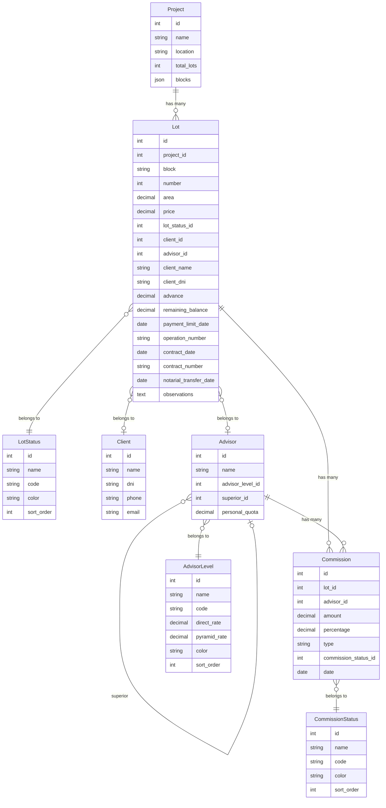
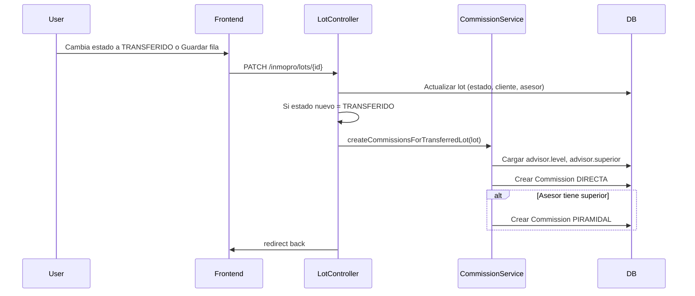

# Análisis del sistema CRM Lotes (Inmopro) – Para uso con ChatGPT / nuevos módulos

**Propósito:** Este documento es un análisis técnico y de dominio del sistema CRM de lotes inmobiliarios (módulo Inmopro). Está pensado para copiarlo en ChatGPT u otra IA y usarlo como base para diseñar o agregar nuevos módulos, manteniendo coherencia con la arquitectura y convenciones actuales.

**Fecha del análisis:** Febrero 2026.

---

## 1. Stack y entorno

### Backend
- **Framework:** Laravel 12
- **PHP:** ^8.3
- **Paquetes principales:**
  - `inertiajs/inertia-laravel` ^2.0 – SPA con React sin API separada
  - `laravel/fortify` ^1.30 – Autenticación (login, registro, 2FA, reset password, verify email)
  - `laravel/wayfinder` ^0.1.9 – Generación de rutas TypeScript desde Laravel
  - `maatwebsite/excel` ^3.1 – Import/export Excel (proyectos y lotes)

### Frontend
- **React** 19 (vía Vite)
- **Inertia.js** v2 – Puente Laravel–React (sin API REST para páginas)
- **TypeScript**
- **Tailwind CSS** v4 (@tailwindcss/vite)
- **Componentes UI:** Radix UI (Dialog, Dropdown, Select, etc.) con estilos tipo shadcn
- **Iconos:** lucide-react
- **Gráficos:** recharts (dashboard, reportes)
- **Bundler:** Vite, con plugin @laravel/vite-plugin-wayfinder

### Base de datos
- Motor por defecto: MySQL (configurable en `.env`; en tests se usa SQLite en memoria)
- Migraciones en `database/migrations/`
- Seeders en `database/seeders/` y `database/seeders/Inmopro/`
- Sin factories para modelos Inmopro (se usan seeders para datos de prueba)

### Convenciones de código
- Reglas y convenciones del proyecto en [AGENTS.md](../AGENTS.md) en la raíz del repositorio (Laravel Boost guidelines, Pint, PHPUnit, Inertia, Wayfinder).

---

## 2. Estructura del proyecto (árbol conceptual)

```
app/
├── Http/
│   ├── Controllers/Inmopro/   # Controladores del módulo
│   ├── Middleware/
│   └── Requests/Inmopro/      # Form Requests (validación)
├── Models/Inmopro/            # Modelos Eloquent del dominio
├── Services/Inmopro/          # Lógica de negocio (ej. CommissionService)
├── Imports/                   # Maatwebsite Excel imports
├── Exports/                   # Maatwebsite Excel exports
├── Actions/Fortify/           # Acciones Fortify (crear usuario, etc.)
└── Providers/

routes/
├── web.php                    # Ruta principal, dashboard
├── inmopro.php                # Rutas del módulo Inmopro (prefijo inmopro)
├── settings.php               # Perfil, contraseña, 2FA, apariencia
└── console.php

resources/js/
├── pages/
│   ├── auth/                  # Login, registro, 2FA, reset/verify password
│   ├── inmopro/               # Páginas del módulo (dashboard, inventory, projects, lots, clients, advisors, financial, commissions, reports, catálogos)
│   └── settings/              # Perfil, contraseña, apariencia, 2FA
├── layouts/                   # app-layout, auth-*
├── components/                # app-sidebar, app-header, nav-*, ui/* (shadcn-style)
├── hooks/
├── lib/
└── types/

database/
├── migrations/
└── seeders/Inmopro/           # AdvisorLevel, LotStatus, CommissionStatus, Project, Advisor, Client, Lot

tests/
├── Feature/                   # Auth, Settings, Dashboard, Inmopro
└── Unit/
```

**Dominio Inmopro:** Todo lo específico del CRM de lotes vive bajo el namespace `App\Models\Inmopro`, `App\Http\Controllers\Inmopro`, etc., y bajo el prefijo de rutas `inmopro` con nombre `inmopro.*`. Las vistas Inertia están en `resources/js/pages/inmopro/`.

**Auth y settings:** No forman parte de Inmopro; están en `routes/web.php`, `routes/settings.php` y `resources/js/pages/auth/`, `resources/js/pages/settings/`. Al agregar módulos nuevos conviene replicar el patrón de Inmopro (rutas propias, controladores y páginas en carpetas dedicadas).

---

## 3. Dominio de negocio (narrativo + diagrama)

### Descripción
La aplicación es un **CRM para gestión de lotes inmobiliarios**. Permite:

- Definir **proyectos** (nombre, ubicación, manzanas) e **inventario de lotes** por proyecto (manzana, número, área, precio).
- Gestionar **estados** de cada lote: **LIBRE**, **RESERVADO**, **TRANSFERIDO** (vendido).
- Asignar **clientes** y **asesores** (vendedores) a lotes reservados o transferidos.
- Registrar datos de contrato y transferencia (adelanto, saldo, fechas, número de operación, etc.).
- Calcular y registrar **comisiones**: **directa** (para el asesor del lote) y **piramidal** (para el superior del asesor), según niveles de asesor con porcentajes configurables.
- Control **financiero** (lotes no libres, totales) y **reportes** por nivel de asesor (ventas, metas).

Los asesores tienen una **jerarquía** (superior/subordinados) y un **nivel** (advisor_level) que define los porcentajes de comisión directa y piramidal. Al marcar un lote como **TRANSFERIDO**, se crean automáticamente las comisiones (una directa y, si hay superior, una piramidal).

### Diagrama de entidades y relaciones



### Entidades en texto (para que la IA no infiera)

| Entidad | Atributos clave | Relaciones |
|--------|------------------|------------|
| **Project** | name, location, total_lots, blocks (JSON array de manzanas) | hasMany Lot |
| **Lot** | project_id, block, number, area, price, lot_status_id, client_id, advisor_id, client_name, client_dni, advance, remaining_balance, payment_limit_date, operation_number, contract_date, contract_number, notarial_transfer_date, observations | belongsTo Project, LotStatus, Client, Advisor; hasMany Commission |
| **Client** | name, dni, phone, email (dni y phone nullable) | hasMany Lot |
| **Advisor** | name, phone, email, advisor_level_id, superior_id, personal_quota | belongsTo AdvisorLevel, Advisor (superior); hasMany Lot, Commission, subordinates |
| **AdvisorLevel** | name, code, direct_rate, pyramid_rate, color, sort_order | hasMany Advisor |
| **LotStatus** | name, code (LIBRE, RESERVADO, TRANSFERIDO), color, sort_order | hasMany Lot |
| **Commission** | lot_id, advisor_id, amount, percentage, type (DIRECTA, PIRAMIDAL), commission_status_id, date | belongsTo Lot, Advisor, CommissionStatus |
| **CommissionStatus** | name, code (PENDIENTE, PAGADO), color, sort_order | hasMany Commission |

---

## 4. Modelos y base de datos

### Tabla resumen: modelo → tabla → campos principales

| Modelo | Tabla | Campos principales |
|--------|--------|---------------------|
| Project | projects | id, name, location, total_lots, blocks (JSON), timestamps |
| Lot | lots | id, project_id, block, number, area, price, lot_status_id, client_id, advisor_id, client_name, client_dni, advance, remaining_balance, payment_limit_date, operation_number, contract_date, contract_number, notarial_transfer_date, observations, timestamps |
| Client | clients | id, name, dni, phone, email, referred_by, timestamps (dni, phone nullable) |
| Advisor | advisors | id, name, phone, email, advisor_level_id, superior_id, personal_quota, timestamps |
| AdvisorLevel | advisor_levels | id, name, code, direct_rate, pyramid_rate, color, sort_order, timestamps |
| LotStatus | lot_statuses | id, name, code, color, sort_order, timestamps |
| Commission | commissions | id, lot_id, advisor_id, amount, percentage, type, commission_status_id, date, timestamps |
| CommissionStatus | commission_statuses | id, name, code, color, sort_order, timestamps |

### Relaciones Eloquent (resumen)

- **Project:** `lots()` hasMany Lot
- **Lot:** `project()`, `status()`, `client()`, `advisor()` belongsTo; `commissions()` hasMany
- **Client:** `lots()` hasMany
- **Advisor:** `level()` belongsTo AdvisorLevel; `superior()` belongsTo Advisor; `subordinates()`, `lots()`, `commissions()` hasMany
- **Commission:** `lot()`, `advisor()`, `commissionStatus()` (o similar) belongsTo

### Migraciones relevantes
- `2026_02_17_155023_create_projects_table.php`
- `2026_02_17_155044_create_advisor_levels_table.php`
- `2026_02_17_155047_create_lot_statuses_table.php`
- `2026_02_17_155049_create_commission_statuses_table.php`
- `2026_02_17_155051_create_advisors_table.php`
- `2026_02_17_155057_create_clients_table.php`
- `2026_02_17_155058_create_lots_table.php`
- `2026_02_17_155100_create_commissions_table.php`
- `2026_02_17_200000_add_client_name_dni_to_lots_table.php` (client_name, client_dni en lots)
- `2026_02_17_230907_make_clients_dni_and_phone_nullable.php`

Campos desnormalizados en `lots`: `client_name`, `client_dni` (y en modelo `client_phone` si se añadió en migración posterior) para mostrar/editar sin depender solo de `client_id`.

### Seeders existentes (Inmopro)
- AdvisorLevelSeeder, LotStatusSeeder, CommissionStatusSeeder, ProjectSeeder, AdvisorSeeder, ClientSeeder, LotSeeder (orden sugerido para ejecución).

---

## 5. Rutas y controladores

### Listado de rutas Inmopro (prefijo `inmopro`, nombre `inmopro.*`, middleware `auth` + `verified`)

| Método | URI | Nombre | Controlador@acción |
|--------|-----|--------|---------------------|
| GET | inmopro/dashboard | inmopro.dashboard | DashboardController@__invoke |
| GET | inmopro/projects/excel-template | inmopro.projects.excel-template | ProjectController@excelTemplate |
| POST | inmopro/projects/import-from-excel | inmopro.projects.import-from-excel | ProjectController@importFromExcel |
| GET/POST/GET/GET/PUT/PATCH/DELETE | inmopro/projects/... | inmopro.projects.* | ProjectController (resource) |
| GET/POST/... | inmopro/lots/... | inmopro.lots.* | LotController (resource) |
| GET | inmopro/clients/search?q= | inmopro.clients.search | ClientController@search (JSON) |
| GET/POST/... | inmopro/clients/... | inmopro.clients.* | ClientController (resource) |
| GET | inmopro/advisors/search?q= | inmopro.advisors.search | AdvisorController@search (JSON) |
| GET/POST/... | inmopro/advisors/... (except destroy) | inmopro.advisors.* | AdvisorController (resource) |
| GET/... | inmopro/lot-statuses/... | inmopro.lot-statuses.* | LotStatusController (resource, param lot_status) |
| GET/... | inmopro/commission-statuses/... | inmopro.commission-statuses.* | CommissionStatusController (resource, param commission_status) |
| GET/... | inmopro/advisor-levels/... | inmopro.advisor-levels.* | AdvisorLevelController (resource, param advisor_level) |
| GET | inmopro/financial | inmopro.financial.index | FinancialController@index |
| GET | inmopro/commissions | inmopro.commissions.index | CommissionController@index |
| POST | inmopro/commissions/{commission}/mark-as-paid | inmopro.commissions.mark-as-paid | CommissionController@markAsPaid |
| GET | inmopro/reports | inmopro.reports.index | ReportController@index |

### Responsabilidad de controladores clave

- **LotController:** Index = inventario (lista de lotes por proyecto, con status/client/advisor). Update: valida con UpdateLotRequest; actualiza estado, cliente (por client_id o por nombre/DNI, creando cliente si no existe) y asesor; si el estado pasa a TRANSFERIDO, llama a `CommissionService::createCommissionsForTransferredLot($lot)`.
- **CommissionService:** `createCommissionsForTransferredLot(Lot)`: crea comisión DIRECTA (precio × direct_rate del nivel del asesor) y, si el asesor tiene superior, comisión PIRAMIDAL (precio × pyramid_rate). `markAsPaid(Commission)` actualiza estado a PAGADO.
- **ClientController:** CRUD; `search(Request)`: GET con `q`, LIKE en name y dni, limit 15, respuesta JSON.
- **AdvisorController:** CRUD (except destroy); `search(Request)`: GET con `q`, LIKE en name, limit 15, respuesta JSON.
- **ProjectController:** CRUD; excelTemplate (descarga plantilla); importFromExcel (importa proyecto + lotes desde Excel).
- **FinancialController:** index con filtros (proyecto, fechas, búsqueda), lista lotes no libres y totales.
- **ReportController:** index con ventas por nivel de asesor, metas (personal_quota), porcentajes y desempeño.

### Endpoints JSON (para autocompletado / selects buscables)
- `GET /inmopro/clients/search?q=...` → JSON array de `{ id, name, dni, phone }`
- `GET /inmopro/advisors/search?q=...` → JSON array de `{ id, name }`

---

## 6. Frontend (páginas y patrones)

### Páginas Inertia (resources/js/pages/inmopro/)
- **dashboard.tsx** – Estadísticas y gráficos por estado y proyecto
- **inventory.tsx** – Inventario de lotes (lista por proyecto, filtro por manzana/número)
- **projects/** – index, create, show, edit (show = ficha de proyecto con tabla de lotes editable)
- **lots/** – create, show, edit
- **clients/** – index, create, show, edit
- **advisors/** – index, create, show, edit
- **financial.tsx** – Control financiero
- **commissions.tsx** – Listado de comisiones, marcar como pagada
- **reports.tsx** – Reportes por nivel
- **lot-statuses/**, **commission-statuses/**, **advisor-levels/** – index, create, show, edit (catálogos)

### Layouts
- **app-layout.tsx** – Layout principal con sidebar colapsable (AppLayout), breadcrumbs
- **auth-*** – Login, registro, 2FA, etc.
- **settings/** – Perfil, contraseña, apariencia

### Patrones usados
- **Búsqueda tipo select:** Hook `useSearchableSelect<T>(fetchFn, { debounceMs, minChars, cacheMax })` en proyecto show: inputs de cliente (nombre, DNI) y asesor con búsqueda por API; resultados en dropdown; al seleccionar se rellenan campos en estado local (edited). Caché en memoria (p. ej. 50 entradas) para no repetir peticiones.
- **Guardado por fila:** En la tabla de lotes (projects/show): solo el **estado** (select de LotStatus) se actualiza inline (onChange → updateLot). El resto de campos (cliente, asesor, área, precio, adelanto, fechas, observaciones, etc.) se editan en estado local y se guardan con un **botón "Guardar"** al final de cada fila, que construye el payload completo de la fila (`buildRowPayloadForSave(lot)`) y llama a `updateLot(lot, payload)`.
- **Formularios:** Uso de `router.get`/`router.post`/`router.patch` con formularios controlados y estado local; no se usa de forma generalizada `useForm` de Inertia. Errores de validación del servidor se leen vía `usePage().props.errors` y se muestran con Alert u otro componente.
- **Navegación:** `Link` de Inertia con `prefetch`; sidebar con `useCurrentUrl` para resaltar ítem activo. Rutas Inmopro en el sidebar están hardcodeadas (ej. `/inmopro/lots`, `/inmopro/clients`); solo `dashboard()` viene de Wayfinder.

### Componentes reutilizables
- **UI (resources/js/components/ui/):** button, input, label, select, checkbox, card, dialog, dropdown-menu, avatar, badge, sidebar, sheet, tooltip, skeleton, alert, etc. (Radix + Tailwind, estilo shadcn).
- **App:** app-sidebar, app-header, app-logo, nav-main, nav-footer, nav-user, breadcrumbs, user-menu-content, input-error, etc.

---

## 7. Autenticación y autorización

- **Fortify:** Login, registro, recuperación de contraseña, verificación de email, confirmación de contraseña, 2FA. Vistas con Inertia; acciones en `App\Actions\Fortify\*`.
- **Middleware:** Rutas Inmopro y dashboard usan `auth` y `verified`. Settings usa `auth` y en partes `verified`.
- **Autorización actual:** No hay Policies ni Gates registrados. Los Form Requests devuelven `authorize(): true`. Cualquier usuario autenticado y verificado puede acceder a todo el módulo Inmopro.
- **Extensión para nuevos módulos:** Si se necesitan permisos por rol o por recurso, conviene añadir Policies (o Gates) y usarlas en controladores o en Form Requests; registrar políticas en `AppServiceProvider` o en un provider dedicado.

---

## 8. Flujos críticos (paso a paso)

### Reserva / transferencia de lote
1. Usuario entra al inventario (`/inmopro/lots?project_id=X`) o a la ficha del proyecto (`/inmopro/projects/{id}`) donde está la tabla de lotes.
2. En la tabla puede cambiar el **estado** (select) → se guarda inline vía `LotController@update` con `lot_status_id`.
3. Puede editar cliente (nombre, DNI, teléfono) y asesor mediante inputs con búsqueda; los valores se mantienen en estado local hasta hacer clic en **Guardar** en esa fila.
4. Al hacer clic en **Guardar**, se envía el payload completo de la fila (incl. client_id si se eligió cliente del dropdown, o null para que backend resuelva/crear cliente por nombre/DNI).
5. `LotController@update`: valida con UpdateLotRequest; si hay client_name, resuelve o crea cliente (por client_id, o por DNI, o por nombre; si no existe, crea con nombre obligatorio, dni y phone opcionales); actualiza lot (fill + save).
6. Si el estado del lote **pasa a TRANSFERIDO** (comparando previousStatusId con el nuevo lot_status_id), se llama a `$this->commissionService->createCommissionsForTransferredLot($lot->fresh())`.

### Creación de comisiones
1. Entrada: lote recién marcado como TRANSFERIDO, con advisor y advisor.level cargados.
2. `CommissionService::createCommissionsForTransferredLot`: obtiene estado PENDIENTE de comisión; calcula precio del lote; crea comisión DIRECTA (advisor del lote, amount = price × direct_rate/100, type DIRECTA); si el asesor tiene superior, crea comisión PIRAMIDAL (advisor superior, amount = price × pyramid_rate/100, type PIRAMIDAL). Fecha = contract_date del lote o hoy.
3. Las comisiones se listan en `/inmopro/commissions` y se pueden marcar como pagadas (CommissionController@markAsPaid → CommissionService::markAsPaid).

### Búsqueda cliente / asesor
- **Clientes:** Frontend llama a `GET /inmopro/clients/search?q=...` (debounced); backend LIKE en name y dni, limit 15; respuesta JSON. Se usa en la tabla de lotes (projects/show) en los inputs de nombre y DNI; al seleccionar un resultado se rellenan nombre, DNI, teléfono y client_id en estado local; al guardar la fila se envía client_id o los campos de texto según corresponda.
- **Asesores:** `GET /inmopro/advisors/search?q=...`, LIKE en name, limit 15; en projects/show el input de asesor es buscable y al seleccionar se guarda advisor_id (y nombre para mostrar) en estado local; el guardado efectivo es al pulsar Guardar en la fila.

### Diagrama de secuencia: Lote pasa a Transferido → Comisiones



---

## 9. Tests existentes

### Ubicación
- `tests/Feature/` – Auth, Settings, Dashboard, Inmopro
- `tests/Unit/` – Ejemplo (ExampleTest)

### Qué se prueba
- **Auth:** Login, logout, rate limit, 2FA challenge, registro, reset password, verificación de email, confirmación de contraseña (AuthenticationTest, RegistrationTest, PasswordResetTest, EmailVerificationTest, VerificationNotificationTest, PasswordConfirmationTest, TwoFactorChallengeTest).
- **Settings:** Actualización de perfil, contraseña, 2FA (ProfileUpdateTest, PasswordUpdateTest, TwoFactorAuthenticationTest).
- **Dashboard:** Invitados redirigen a login; autenticados ven dashboard (DashboardTest).
- **Inmopro:**
  - **Lots:** Invitados no acceden; autenticados ven inventario; actualización de estado; al pasar a TRANSFERIDO se crean comisiones; actualización con solo nombre de cliente crea cliente y lo asocia (InmoproLotsTest).
  - **Commissions:** Invitados no acceden; autenticados ven listado; marcar como pagada (InmoproCommissionsTest).
  - **Projects:** Invitados no acceden; autenticados ven índice, crean y actualizan proyecto (InmoproProjectsTest).
  - **Clients:** Invitados no acceden; autenticados ven índice, crean y actualizan cliente; búsqueda JSON con LIKE (InmoproClientsTest).
  - **Advisors:** Invitados no acceden; autenticados ven índice, crean y actualizan asesor (InmoproAdvisorsTest).

### Qué no está cubierto
- Import/export Excel (ProjectController excelTemplate, importFromExcel).
- FinancialController, ReportController.
- Catálogos (lot-statuses, commission-statuses, advisor-levels) CRUD.
- Endpoint de búsqueda de asesores (advisors/search JSON).

---

## 10. Puntos fuertes y deuda técnica

### Puntos fuertes
- Dominio Inmopro bien delimitado (modelos, controladores, servicios, rutas y páginas propias).
- Comisiones automáticas al transferir lote y modelo directa/piramidal por nivel bien acotado en CommissionService.
- Frontend consistente: layouts, sidebar por secciones, componentes UI reutilizables, patrones de búsqueda y guardado por fila claros.
- Tests de feature que cubren acceso, CRUD básico y el flujo reserva → transferido → comisiones.

### Deuda técnica / riesgos
- **Autorización:** Todo usuario verificado puede hacer todo en Inmopro; no hay roles ni políticas. Si el negocio requiere permisos por rol o por recurso, falta implementarlo.
- **Cliente:** Creación/actualización desde LotController por nombre/DNI puede generar duplicados si no se unifica criterio (ej. por DNI cuando exista).
- **Rutas en frontend:** Muchas URLs Inmopro están hardcodeadas en app-sidebar y en páginas; Wayfinder se usa solo para dashboard(). Conviene generar rutas con Wayfinder para evitar desincronización.
- **Formularios:** No se usa de forma generalizada useForm ni el componente Form de Inertia; la validación de errores del servidor podría centralizarse mejor.
- **Tests:** Sin tests para importación Excel, reportes, control financiero, catálogos ni búsqueda de asesores.

### Recomendaciones
1. Introducir políticas (o comprobaciones por rol) para Inmopro si habrá más de un tipo de usuario.
2. Unificar criterio de cliente único (ej. por DNI) y opcionalmente desduplicar en backend al asignar cliente a un lote.
3. Exponer rutas Inmopro vía Wayfinder y usar esas funciones en el frontend en lugar de strings.
4. Añadir tests para import/export de proyectos, reportes y control financiero.
5. Valorar uso de useForm y Form de Inertia en formularios complejos para manejo de errores y estado.

---

## 11. Guía para agregar nuevos módulos

### Cómo replicar la estructura
1. **Backend:** Crear modelos bajo `App\Models\Inmopro\` (o un nuevo namespace si el módulo es independiente), migraciones en `database/migrations/`, controladores bajo `App\Http\Controllers\Inmopro\` (o nuevo namespace), Form Requests en `App\Http\Requests\Inmopro\`. Si hay lógica de negocio compartida, considerar `App\Services\Inmopro\` o un servicio específico del módulo.
2. **Rutas:** Añadir un grupo en `routes/inmopro.php` (o nuevo archivo de rutas y registrarlo en bootstrap/app.php) con prefijo y nombre coherentes (ej. `inmopro.nuevo-modulo.*`), middleware `auth` y `verified`.
3. **Frontend:** Crear páginas en `resources/js/pages/inmopro/nuevo-modulo/` (o carpeta equivalente), usar `AppLayout` y breadcrumbs; añadir enlaces en el sidebar (app-sidebar.tsx) si el módulo debe aparecer en el menú.
4. **Datos compartidos:** Si el módulo necesita datos globales en cada request, usar el middleware HandleInertiaRequests (share) o Inertia::share en un service provider.

### Checklist sugerido para un módulo nuevo
- [ ] Modelo(s) + migración(es)
- [ ] Controlador(es) + rutas (resource o rutas concretas)
- [ ] Form Request(s) para validación y authorize()
- [ ] Página(s) Inertia (listado, crear, editar, ver según necesidad)
- [ ] Layout y breadcrumbs coherentes con el resto de la app
- [ ] Entrada en el sidebar si aplica
- [ ] Tests de feature: acceso (invitado no accede, autenticado sí), CRUD básico si aplica

### Dónde enganchar si el módulo afecta a lotes o comisiones
- **Eventos:** Si al transferir un lote o al pagar una comisión debe dispararse lógica de otro módulo, valorar eventos de Laravel (ej. LotTransferred, CommissionPaid) y listeners en el nuevo módulo, en lugar de acoplar todo en CommissionService o LotController.
- **Servicios compartidos:** Si la lógica es común (ej. cálculos de comisión o de financiero), extraer a un servicio en `App\Services\Inmopro\` y usarlo desde el controlador del nuevo módulo y desde los existentes si aplica.
- **Base de datos:** Si el nuevo módulo necesita tablas que referencian a lots, advisors o commissions, usar foreignId y constraints coherentes con las migraciones existentes.

---

*Fin del documento. Puedes copiar todo este archivo en ChatGPT y usarlo como contexto para preguntas del tipo: "Quiero agregar un módulo de [X]. Sugiere arquitectura y pasos." o "¿Cómo integraría [Y] con el flujo de comisiones?"*
