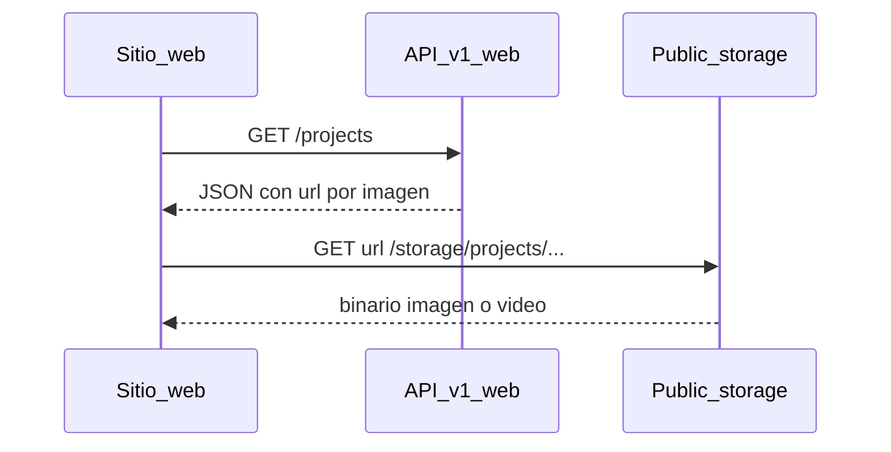

# API Web (catálogo público)

## Resumen

API **sin autenticación** para sitios web, landings o apps que muestran el catálogo de **proyectos Inmopro**: ubicación, tipo, conteo de lotes, lotes libres e imágenes/vídeos promocionales.

| Concepto | Valor |
|----------|--------|
| Base path | `/api/v1/web` |
| Formato | JSON (`Content-Type: application/json`) |
| Autenticación | Ninguna |
| Rate limit | `120` solicitudes por minuto por IP (`throttle:120,1`) |
| Medios | Disco **`public`** → URLs directas bajo `{APP_URL}/storage/...` |

Documentación relacionada:

- API vendedores (Cazador): [API_CAZADOR.md](./API_CAZADOR.md)
- API dateros: [API_DATERO.md](./API_DATERO.md)
- **Prompt Cursor (React + Laravel):** [PROMPT_CURSOR_REACT_WEB_API.md](./PROMPT_CURSOR_REACT_WEB_API.md)

Controlador: `App\Http\Controllers\Api\v1\Web\WebController`.

Tipos y cliente en el monorepo: `resources/js/types/api-web.ts`, `resources/js/lib/api-web-client.ts`.

## Requisitos de almacenamiento (servidor)

Los archivos de proyecto (imágenes, vídeos, documentos subidos desde Inmopro) se guardan en **`storage/app/public`**, no en el disco privado `local`.

1. En `.env`, define la URL pública correcta:
   ```env
   APP_URL=https://tu-dominio.com
   ```
2. Crea el enlace simbólico (una vez por entorno):
   ```bash
   php artisan storage:link
   ```
3. Tras subir medios en **Inmopro → Proyectos**, el archivo queda en rutas como:
   `storage/app/public/projects/{projectId}/images/{nombre-generado}.jpg`
4. El JSON del API expone la URL pública:
   `https://tu-dominio.com/storage/projects/{projectId}/images/{nombre-generado}.jpg`

Puedes usar esa URL en ``, `<video src="...">` o `fetch` sin pasar por el API.

## Resumen global (`summary`)

Incluido solo en **`GET /api/v1/web/projects`**:

| Campo | Tipo | Descripción |
|--------|------|-------------|
| `projects_count` | int | Cantidad de proyectos |
| `lots_total` | int | Total de lotes en el sistema |
| `lots_free` | int | Lotes con estado `LIBRE` |
| `images_total` | int | Activos activos clasificados como imagen |
| `videos_total` | int | Activos activos clasificados como vídeo |

## Clasificación de medios

Solo activos con `is_active = true`, ordenados por `sort_order` e `id`.

| Grupo | Criterio |
|--------|-----------|
| **Imagen** | `kind === "image"` **o** `mime_type` empieza por `image/` |
| **Vídeo** | `kind === "video"` **o** `mime_type` empieza por `video/` |

Los **documentos** (`kind === "document"`, PDF, etc.) **no** se listan en este API (sí en API Cazador para vendedores autenticados).

## Lotes libres

Un lote es **libre** si `lot_statuses.code === "LIBRE"` (misma regla que el panel Inmopro).

## Objeto `project`

Cada proyecto en `data` (listado o detalle) tiene:

| Campo | Tipo | Descripción |
|--------|------|-------------|
| `id` | int | ID del proyecto |
| `name` | string | Nombre comercial |
| `location` | string\|null | Ubicación |
| `blocks` | array | Bloques o sectores (JSON del proyecto) |
| `total_lots` | int\|null | Total planificado |
| `lots_count` | int | Lotes registrados en BD |
| `free_lots_count` | int | Lotes en estado libre |
| `project_type` | object\|null | `{ id, name, code }` |
| `images_count` | int | Cantidad de imágenes en la respuesta |
| `videos_count` | int | Cantidad de vídeos en la respuesta |
| `images` | array | Lista de activos imagen |
| `videos` | array | Lista de activos vídeo |

## Objeto activo (imagen / vídeo)

| Campo | Tipo | Descripción |
|--------|------|-------------|
| `id` | int | ID del activo |
| `kind` | string | `image`, `video` (u otro si el MIME coincide) |
| `title` | string | Título mostrado |
| `file_name` | string | Nombre original del archivo |
| `mime_type` | string | Tipo MIME |
| `file_size` | int | Tamaño en bytes |
| `url` | string | **URL pública absoluta** al archivo en `/storage/...` |

## Endpoints

### `GET /api/v1/web/projects`

Lista todos los proyectos (orden: `name`) con resumen global.

**Respuesta `200`**

```json
{
  "summary": {
    "projects_count": 3,
    "lots_total": 150,
    "lots_free": 42,
    "images_total": 12,
    "videos_total": 2
  },
  "data": [
    {
      "id": 1,
      "name": "Residencial Los Olivos",
      "location": "Lima Norte",
      "blocks": ["A", "B"],
      "total_lots": 100,
      "lots_count": 100,
      "free_lots_count": 30,
      "project_type": {
        "id": 1,
        "name": "Lotes residenciales",
        "code": "RES"
      },
      "images_count": 2,
      "videos_count": 1,
      "images": [
        {
          "id": 10,
          "kind": "image",
          "title": "Masterplan",
          "file_name": "plan.png",
          "mime_type": "image/png",
          "file_size": 245760,
          "url": "https://tu-dominio.com/storage/projects/1/images/abc123.png"
        }
      ],
      "videos": [
        {
          "id": 11,
          "kind": "video",
          "title": "Recorrido virtual",
          "file_name": "tour.mp4",
          "mime_type": "video/mp4",
          "file_size": 15728640,
          "url": "https://tu-dominio.com/storage/projects/1/videos/def456.mp4"
        }
      ]
    }
  ]
}
```

### `GET /api/v1/web/projects/{id}`

Detalle de un proyecto. Misma estructura que un elemento de `data` (sin `summary`).

**Respuesta `200`**

```json
{
  "data": {
    "id": 1,
    "name": "Residencial Los Olivos",
    "location": "Lima Norte",
    "blocks": ["A", "B"],
    "total_lots": 100,
    "lots_count": 100,
    "free_lots_count": 30,
    "project_type": { "id": 1, "name": "Lotes residenciales", "code": "RES" },
    "images_count": 2,
    "videos_count": 1,
    "images": [],
    "videos": []
  }
}
```

**Respuesta `404`**: proyecto inexistente.

### `GET /api/v1/web/projects/{projectId}/assets/{assetId}` (opcional / compatibilidad)

Redirige (`302`) a la **misma URL pública** que el campo `url` del JSON. Útil si guardaste enlaces antiguos al API en lugar del `/storage/...`.

**Respuesta `302`**: `Location: {url pública}`

**Respuesta `404`**: activo inactivo, pertenece a otro proyecto, o archivo no existe en disco.

Ruta nombrada: `api.v1.web.projects.assets.show`.

## Errores habituales

| Código | Situación |
|--------|-----------|
| `404` | Proyecto o activo no encontrado, activo inactivo, archivo borrado del disco |
| `429` | Demasiadas solicitudes (superar 120/min por IP) |

Cuerpo de error Laravel estándar (JSON o HTML según cabecera `Accept`).

## Ejemplos

### curl

```bash
# Listado con resumen
curl -s -H "Accept: application/json" \
  "https://tu-dominio.com/api/v1/web/projects" | jq .

# Detalle de proyecto
curl -s -H "Accept: application/json" \
  "https://tu-dominio.com/api/v1/web/projects/1" | jq .

# Descargar / abrir imagen (URL directa recomendada)
curl -sI "https://tu-dominio.com/storage/projects/1/images/abc123.png"

# Compatibilidad: redirección desde ruta API
curl -sI "https://tu-dominio.com/api/v1/web/projects/1/assets/10"
```

### JavaScript (fetch + UI)

```javascript
const baseUrl = 'https://tu-dominio.com';

const res = await fetch(`${baseUrl}/api/v1/web/projects`, {
  headers: { Accept: 'application/json' },
});
const { summary, data } = await res.json();

console.log(`${summary.projects_count} proyectos, ${summary.lots_free} lotes libres`);

for (const project of data) {
  const cover = project.images[0]?.url;
  if (cover) {
    // Usar url directamente; no requiere token ni cabeceras extra
    console.log(project.name, cover);
  }
}
```

### React (imagen de portada)

```jsx
{project.images[0] ? (
  
) : null}
```

## Flujo recomendado para el front web



1. Cargar catálogo con `GET /projects` (o detalle con `GET /projects/{id}`).
2. Mostrar `free_lots_count`, `location`, `project_type`.
3. Usar `images[].url` y `videos[].url` como `src` directo.
4. No cachear el JSON más de lo necesario; las URLs de `/storage` son estables mientras no se reemplace el archivo.

## Subida de archivos (panel Inmopro)

Este API **no** sube archivos. La carga se hace en el panel:

- **Inmopro → Proyectos → Editar** → campos `image_files` y `document_files`.
- Ruta en disco: `projects/{id}/images/` y `projects/{id}/documents/` en disco **`public`**.
- Tras guardar, el catálogo web refleja los activos activos en el siguiente `GET /projects`.

Para vídeos en el catálogo web, el activo debe registrarse con `kind = video` o `mime_type` `video/*` (según cómo se incorpore en negocio; hoy el formulario web sube imágenes y documentos).

## Rutas registradas

| Método | URI | Nombre |
|--------|-----|--------|
| GET | `/api/v1/web/projects` | `api.v1.web.projects.index` |
| GET | `/api/v1/web/projects/{project}` | `api.v1.web.projects.show` |
| GET | `/api/v1/web/projects/{project}/assets/{asset}` | `api.v1.web.projects.assets.show` |

Definidas en `routes/api.php`.

## Checklist de despliegue

- [ ] `APP_URL` apunta al dominio público real (HTTPS en producción).
- [ ] `php artisan storage:link` ejecutado.
- [ ] Permisos de escritura en `storage/app/public`.
- [ ] Probar una URL de ejemplo del JSON en el navegador (debe devolver la imagen, no 404).
- [ ] Rate limit adecuado si el sitio tiene mucho tráfico (ajustar en `routes/api.php` si hace falta).
