# Gráfico de procesos del sistema CRM Lotes Markdow

Documento de referencia con diagramas Mermaid del sistema **CRM Lotes**, alineado con **API Cazador**, **API Datero** e **Inmopro** (panel web).

**Referencias cruzadas**

- Flujo de negocio (CRM → venta → postventa, diagrama único): [flujo_crm_venta_postventa.md](./flujo_crm_venta_postventa.md)
- Contrato API asesor: [API_CAZADOR.md](./API_CAZADOR.md) · Análisis: [ANALISIS_API_CAZADOR.md](./ANALISIS_API_CAZADOR.md)
- Contrato API datero: [API_DATERO.md](./API_DATERO.md)
- Evaluación de roles/permisos y Spatie: [EVALUACION_RBAC_Y_SPATIE.md](./EVALUACION_RBAC_Y_SPATIE.md)

---

## Índice

1. [Arquitectura general](#1-arquitectura-general-actores-canales-y-almacenamiento)
2. [Recorrido operativo del asesor en API Cazador](#2-recorrido-operativo-del-asesor-en-api-cazador)
3. [Flujo detallado de pre-reserva desde la app](#3-flujo-detallado-de-pre-reserva-desde-la-app)
4. [Flujo de transferencia con aprobación posterior](#4-flujo-de-transferencia-con-aprobación-posterior)
5. [Doble estado del lote y de la revisión de transferencia](#5-doble-estado-del-lote-y-de-la-revisión-de-transferencia)
6. [Mapa de estados del lote](#6-mapa-de-estados-del-lote)
7. [Cobranza y cuentas por cobrar por lote](#7-cobranza-y-cuentas-por-cobrar-por-lote)
8. [Flujo de comisiones](#8-flujo-de-comisiones)
9. [Ciclo de clientes en backoffice y Excel](#9-ciclo-de-clientes-en-backoffice-y-excel)
10. [Flujo de membresías de asesores](#10-flujo-de-membresías-de-asesores)
11. [Recordatorios en API Cazador (cliente PROPIO)](#11-recordatorios-en-api-cazador-cliente-propio)
12. [Tickets de atención y firma de escritura](#12-tickets-de-atención-y-firma-de-escritura)
13. [Caja, bancos y movimientos operativos](#13-caja-bancos-y-movimientos-operativos)
14. [Vista ejecutiva de módulos Inmopro](#14-vista-ejecutiva-de-módulos-inmopro)
15. [Canal API Datero y frontera con Inmopro y Cazador](#15-canal-api-datero-y-frontera-con-inmopro-y-cazador)
16. [Agenda y recordatorios en Inmopro](#16-agenda-y-recordatorios-en-inmopro)
17. [Importación de proyectos desde Excel](#17-importación-de-proyectos-desde-excel)
18. [Configuración de reportes y salidas](#18-configuración-de-reportes-y-salidas)
19. [Sugerencia de seguimiento con IA (lote)](#19-sugerencia-de-seguimiento-con-ia-lote)
20. [Resumen de rutas por proceso](#20-resumen-de-rutas-por-proceso)

---

## 1. Arquitectura general: actores, canales y almacenamiento

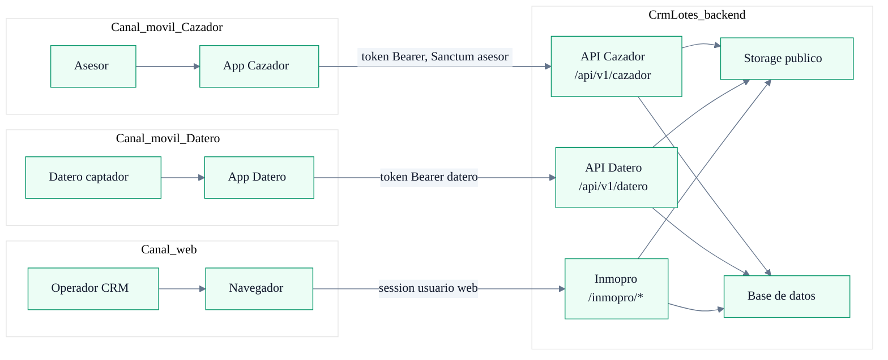

---

## 2. Recorrido operativo del asesor en API Cazador

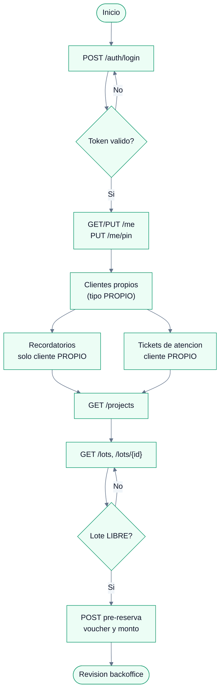

---

## 3. Flujo detallado de pre-reserva desde la app

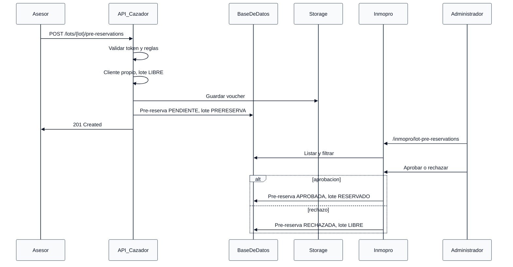

---

## 4. Flujo de transferencia con aprobación posterior

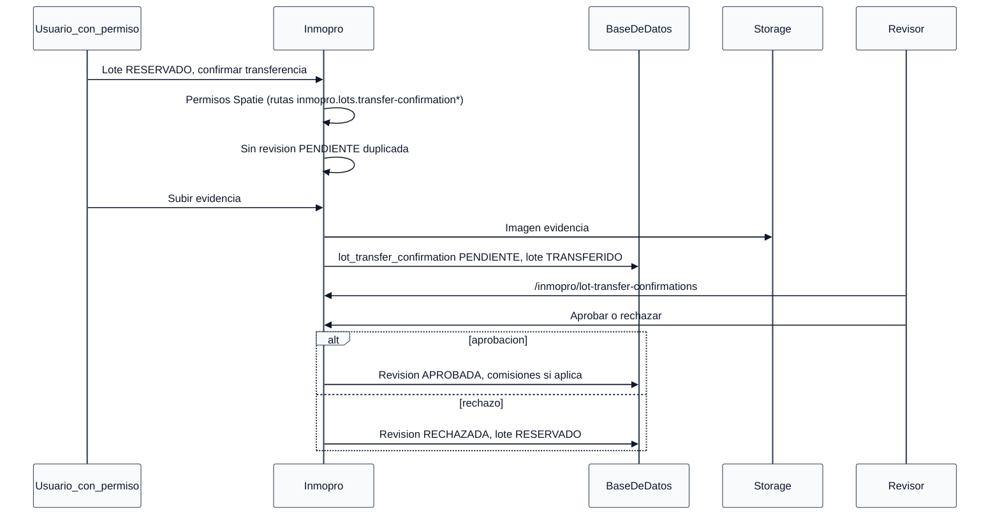

---

## 5. Doble estado del lote y de la revisión de transferencia

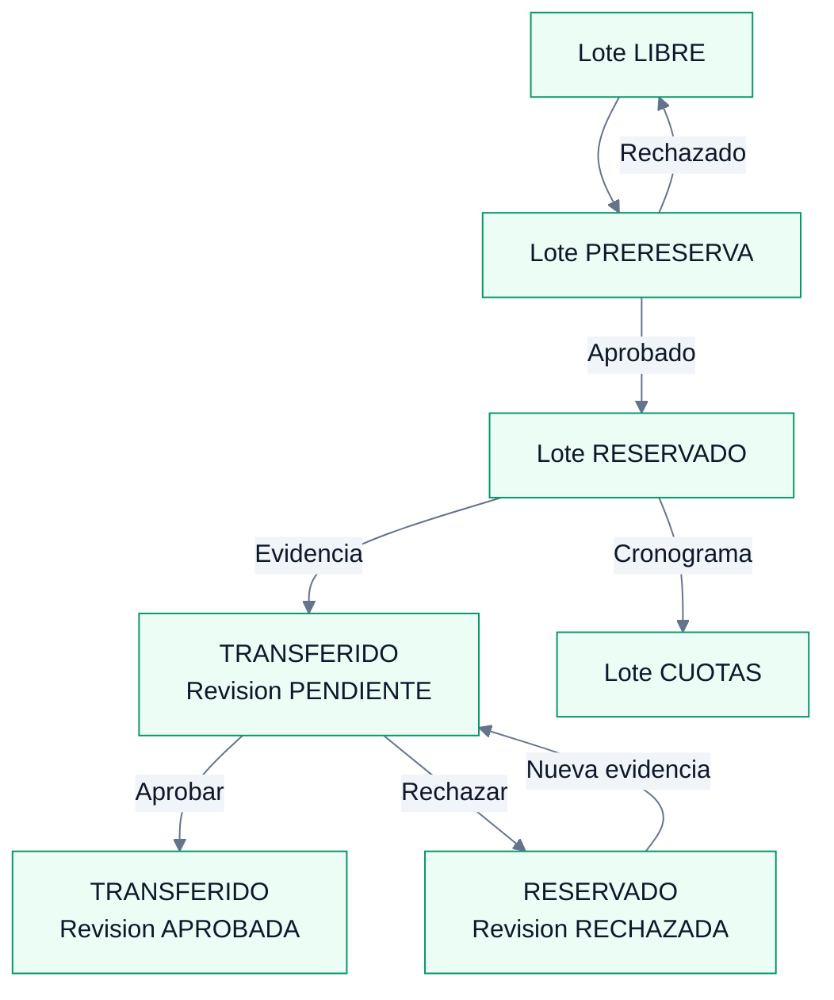

---

## 6. Mapa de estados del lote

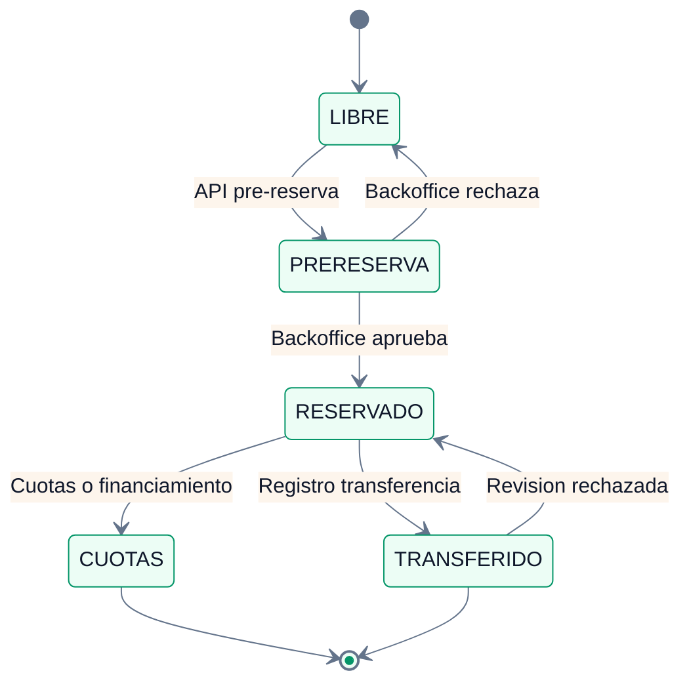

_Códigos de sistema alineados con el modelo `LotStatus`: LIBRE, PRERESERVA, RESERVADO, TRANSFERIDO, CUOTAS._

---

## 7. Cobranza y cuentas por cobrar por lote

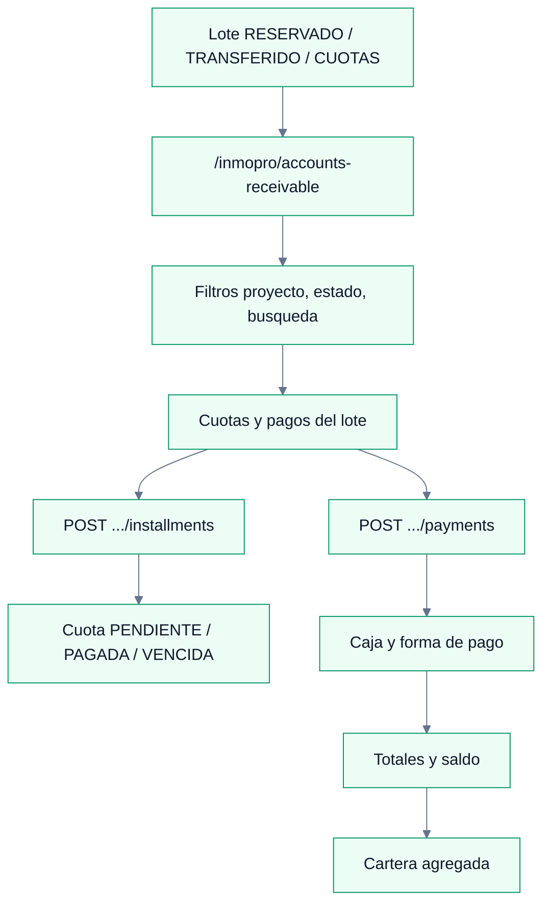

---

## 8. Flujo de comisiones

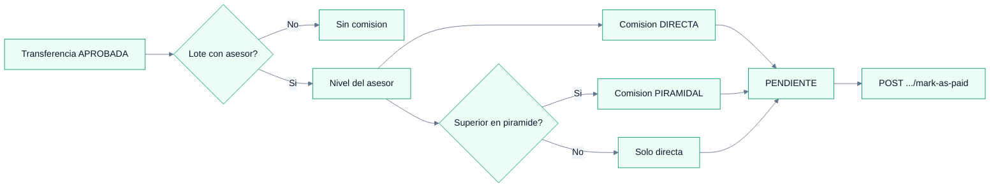

---

## 9. Ciclo de clientes en backoffice y Excel

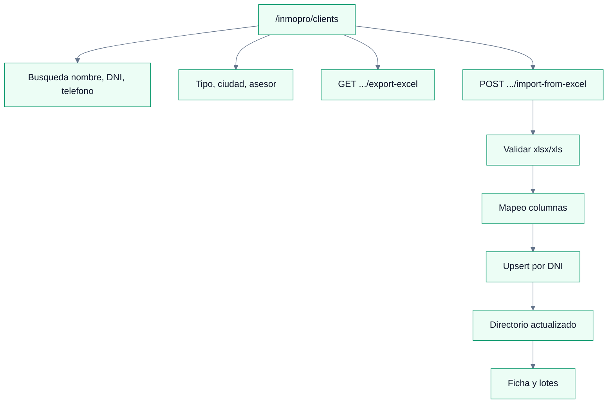

---

## 10. Flujo de membresías de asesores

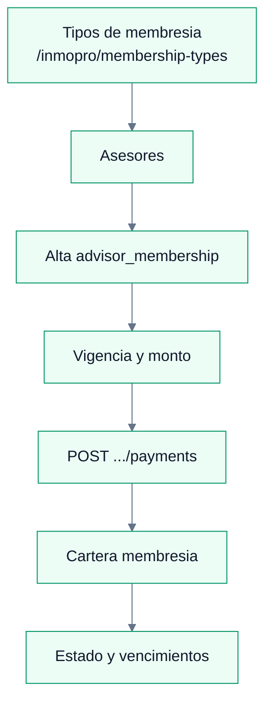

---

## 11. Recordatorios en API Cazador (cliente PROPIO)

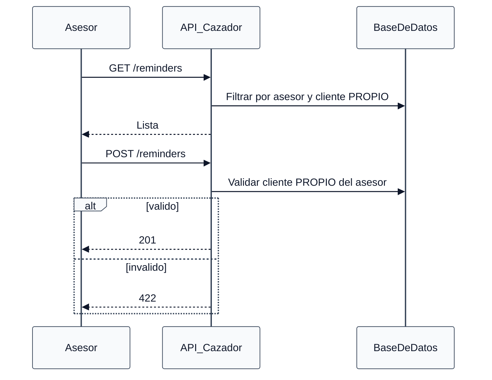

---

## 12. Tickets de atención y firma de escritura

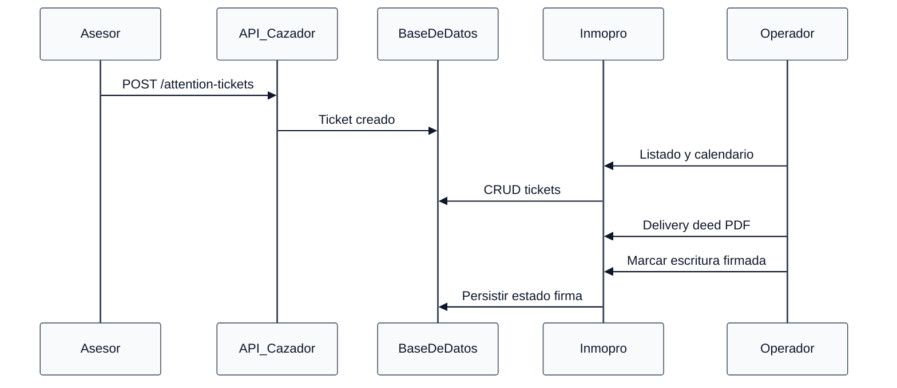

---

## 13. Caja, bancos y movimientos operativos

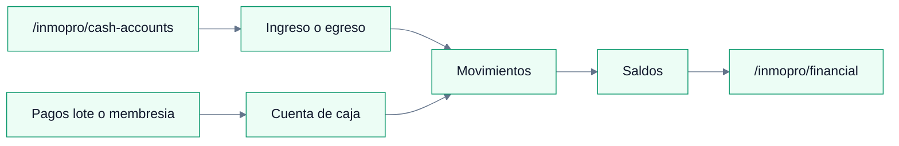

---

## 14. Vista ejecutiva de módulos Inmopro

```mermaid
%%{init: {'theme':'base', 'themeVariables': {'primaryColor':'#ecfdf5','primaryTextColor':'#0f172a','primaryBorderColor':'#059669','lineColor':'#64748b','secondaryColor':'#f1f5f9','tertiaryColor':'#ffffff'}}}%%
flowchart TB
    dashboard["Dashboard"] --> masters["Maestros"]
    dashboard --> sales["Ventas y cartera"]
    dashboard --> operations["Operacion"]
    dashboard --> finance["Finanzas"]
    dashboard --> reports["Reportes y docs"]
    dashboard --> systemArea["Sistema"]

    masters --> projects["Proyectos y lotes"]
    masters --> catalogs["Tipos cliente, ciudades,\ndateros, estados, niveles, teams"]
    sales --> clients["Clientes"]
    sales --> advisors["Asesores y membresias"]
    sales --> agendaLink["Agenda"]
    operations --> prereTab["Pre-reservas"]
    operations --> transferTab["Transferencias"]
    operations --> tickets["Tickets"]
    finance --> receivableTab["Cuentas por cobrar"]
    finance --> cashTab["Caja y bancos"]
    finance --> commissions["Comisiones"]
    reports --> pdfReports["PDF y CSV"]
    reports --> metaReports["Meta reportes"]
    reports --> processDocs["Diagramas de procesos"]
    systemArea --> branding["Personalizacion / branding"]
```

---

## 15. Canal API Datero y frontera con Inmopro y Cazador

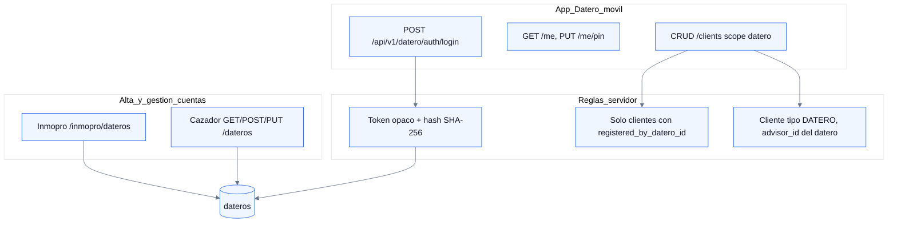

_Detalle de endpoints y errores: [API_DATERO.md](./API_DATERO.md)._

---

## 16. Agenda y recordatorios en Inmopro

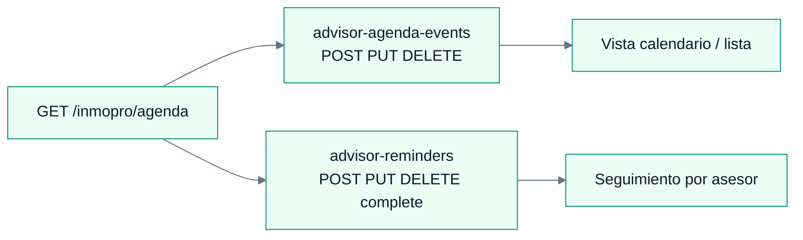

---

## 17. Importación de proyectos desde Excel

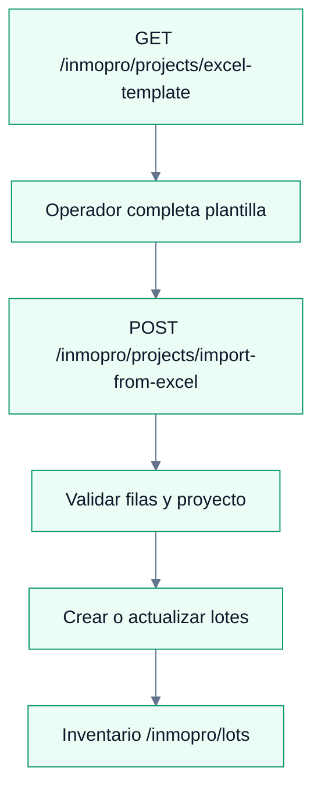

---

## 18. Configuración de reportes y salidas

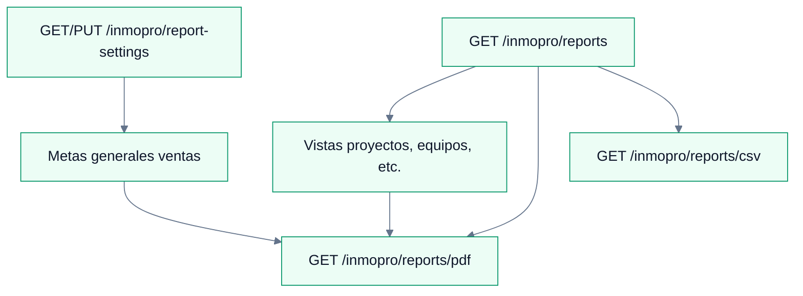

---

## 19. Sugerencia de seguimiento con IA (lote)

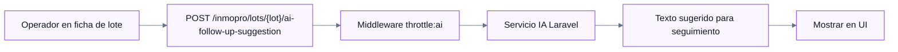

---

## 20. Resumen de rutas por proceso

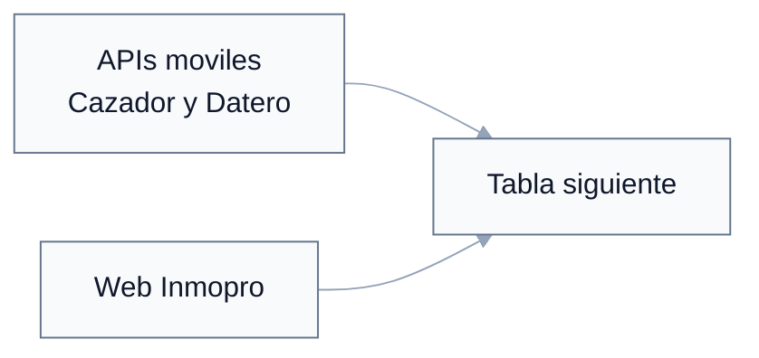

| Proceso | Canal | Rutas principales |
|---------|-------|-------------------|
| Login asesor | API Cazador | `POST /api/v1/cazador/auth/login` |
| Perfil asesor | API Cazador | `GET/PUT /me`, `PUT /me/pin` |
| Dateros desde app asesor | API Cazador | `GET/POST /dateros`, `PUT /dateros/{id}` |
| Clientes del asesor | API Cazador | `GET/POST /clients`, `GET/PUT /clients/{id}` |
| Recordatorios asesor | API Cazador | `GET/POST /reminders`, `GET/PUT/DELETE /reminders/{id}`, `POST /reminders/{id}/complete` (cliente **PROPIO**) |
| Tickets asesor | API Cazador | `GET/POST /attention-tickets`, `POST /attention-tickets/{id}/cancel` |
| Proyectos y lotes | API Cazador | `GET /projects`, `GET /projects/{id}`, `GET /lots`, `GET /lots/{id}`, `GET /my-lots` |
| Pre-reserva | API Cazador | `POST /lots/{lot}/pre-reservations` |
| Login datero | API Datero | `POST /api/v1/datero/auth/login` |
| Perfil datero | API Datero | `GET /me`, `PUT /me/pin`, `POST /auth/logout` |
| Clientes captados por datero | API Datero | `GET/POST /clients`, `GET/PUT /clients/{id}` (alcance `registered_by_datero_id`) |
| Ciudades API | Cazador / Datero | `GET /api/v1/cazador/cities`, `GET /api/v1/datero/cities` |
| Dashboard Inmopro | Web | `GET /inmopro/dashboard` |
| Proyectos y plantilla Excel | Web | `/inmopro/projects`, `GET .../excel-template`, `POST .../import-from-excel` |
| Directorio clientes | Web | `/inmopro/clients`, `GET .../export-excel`, `POST .../import-from-excel`, `GET .../search` |
| Tipos cliente, ciudades, teams, niveles | Web | `/inmopro/client-types`, `/cities`, `/teams`, `/advisor-levels` |
| Asesores y acceso Cazador | Web | `/inmopro/advisors`, `PUT .../cazador-access` |
| Dateros backoffice | Web | `/inmopro/dateros` (resource) |
| Tipos y membresías asesor | Web | `/inmopro/membership-types`, bulk-assign, `/inmopro/advisor-memberships` |
| Inventario lotes | Web | `/inmopro/lots`, `GET .../export-pdf`, `POST .../ai-follow-up-suggestion` |
| Estados catálogo | Web | `/inmopro/lot-statuses`, `/inmopro/commission-statuses` |
| Pre-reservas backoffice | Web | `/inmopro/lot-pre-reservations`, `POST .../approve`, `POST .../reject` |
| Transferencias | Web | `/inmopro/lot-transfer-confirmations`, `GET/POST /inmopro/lots/{lot}/transfer-confirmation`, approve/reject |
| Cobranza | Web | `/inmopro/accounts-receivable`, `POST .../lots/{lot}/installments`, `POST .../lots/{lot}/payments` |
| Caja y bancos | Web | `/inmopro/cash-accounts`, `POST ...`, `POST .../{id}/entries` |
| Vista financiera | Web | `GET /inmopro/financial` |
| Comisiones | Web | `/inmopro/commissions`, `POST .../{id}/mark-as-paid` |
| Tickets admin | Web | `/inmopro/attention-tickets`, `.../calendar`, `.../delivery-deed`, `mark-signed` |
| Agenda backoffice | Web | `/inmopro/agenda`, `advisor-agenda-events`, `advisor-reminders` |
| Reportes | Web | `/inmopro/reports`, `/reports/pdf`, `/reports/csv`, `/inmopro/report-settings` |
| Branding | Web | `GET/PUT /inmopro/branding` |
| Diagramas | Web | `GET /inmopro/process-diagrams` |

---

Para exportar a imagen de alta calidad use [mermaid.live](https://mermaid.live) o una extensión Mermaid en el editor.
