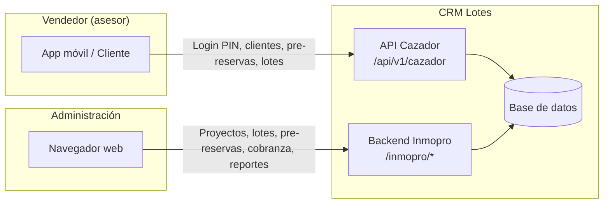
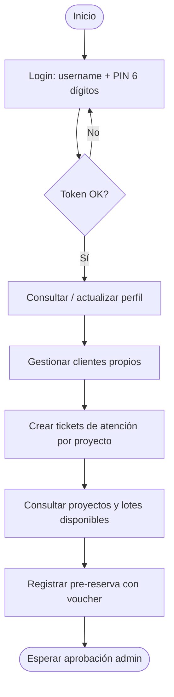
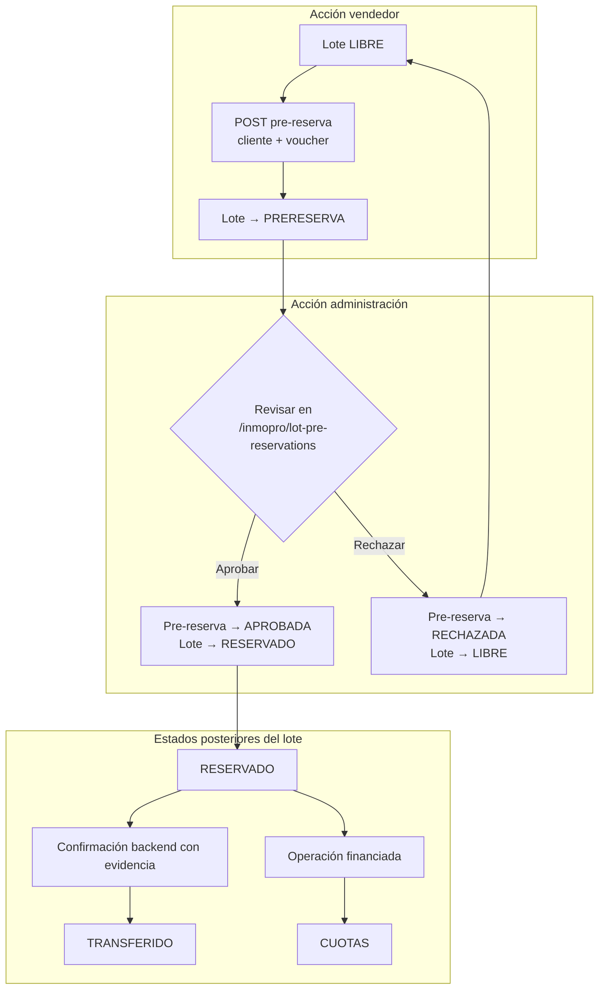
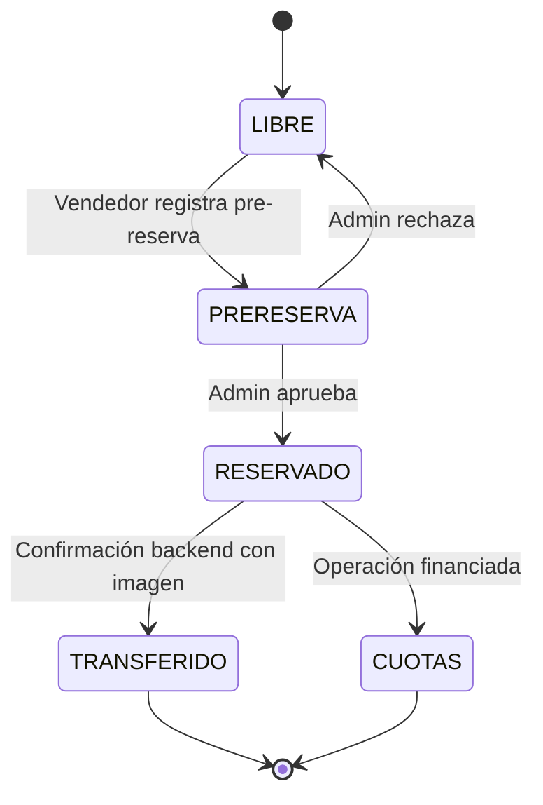
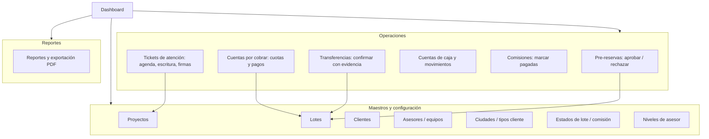
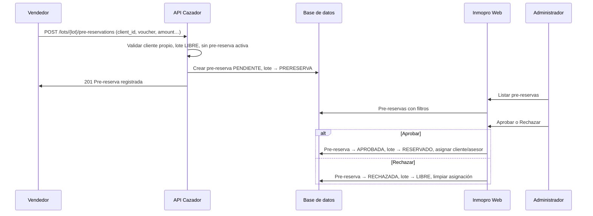
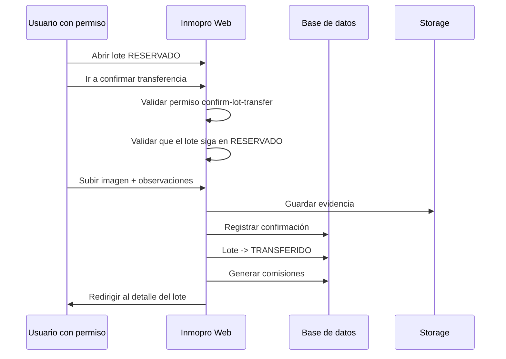

# Gráfico de procesos del sistema CRM Lotes

Documento con diagramas de procesos del sistema (Cazador API + Inmopro web). Se pueden visualizar en cualquier visor de Mermaid (GitHub, VS Code, [mermaid.live](https://mermaid.live)).

---

## 1. Vista general: actores y canales

---

## 2. Flujo del vendedor (API Cazador)

---

## 3. Flujo de pre-reserva y estados del lote

---

## 4. Máquina de estados del lote

---

## 5. Procesos del backend Inmopro (administración)

---

## 6. Flujo detallado: pre-reserva (vendedor → admin)

---

## 7. Flujo detallado: confirmación de transferencia (backend)

---

## 8. Resumen de rutas por proceso

| Proceso              | Canal   | Rutas principales |
|----------------------|---------|--------------------|
| Login vendedor       | API     | `POST /api/v1/cazador/auth/login` |
| Perfil vendedor      | API     | `GET/PUT /me`, `PUT /me/pin` |
| Clientes del vendedor| API     | `GET/POST /clients`, `GET/PUT /clients/{id}` |
| Tickets de atención  | API     | `GET/POST /attention-tickets`, `POST .../cancel` |
| Proyectos y lotes    | API     | `GET /projects`, `GET /lots` |
| Pre-reserva          | API     | `POST /lots/{lot}/pre-reservations` |
| Aprobar/Rechazar pre-reserva | Web | `POST /inmopro/lot-pre-reservations/{id}/approve|reject` |
| Confirmar transferencia | Web | `GET/POST /inmopro/lots/{id}/transfer-confirmation` |
| Cuentas por cobrar   | Web     | `/inmopro/accounts-receivable`, cuotas y pagos por lote |
| Comisiones           | Web     | `/inmopro/commissions`, marcar pagadas |
| Reportes             | Web     | `/inmopro/reports`, PDF |
| Tickets atención (admin) | Web | `/inmopro/attention-tickets`, calendario, escritura |

---

Para generar una imagen a partir de un diagrama Mermaid se puede usar [mermaid.live](https://mermaid.live) o la extensión Mermaid en VS Code / Cursor.
