# Gráfico de procesos del sistema CRM Lotes

Documento actualizado con diagramas Mermaid del sistema `CRM Lotes`, alineado con el flujo actual de `API Cazador` y `Inmopro web`.

---

## 1. Arquitectura general: actores, canales y almacenamiento

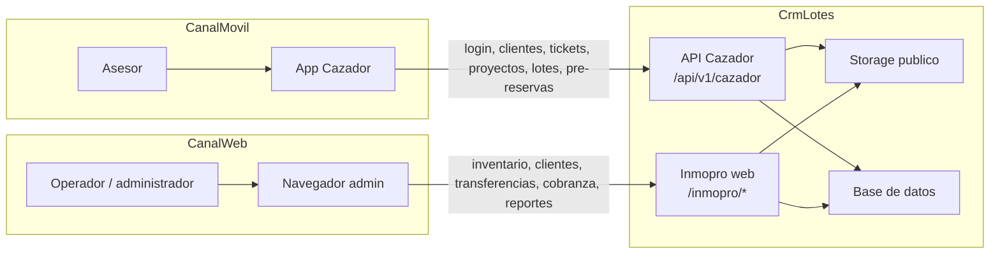

---

## 2. Recorrido operativo del asesor en API Cazador

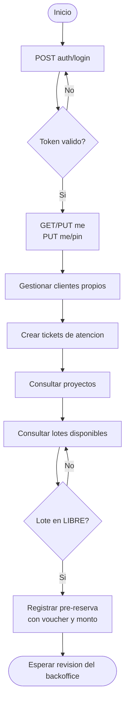

---

## 3. Flujo detallado de pre-reserva desde la app

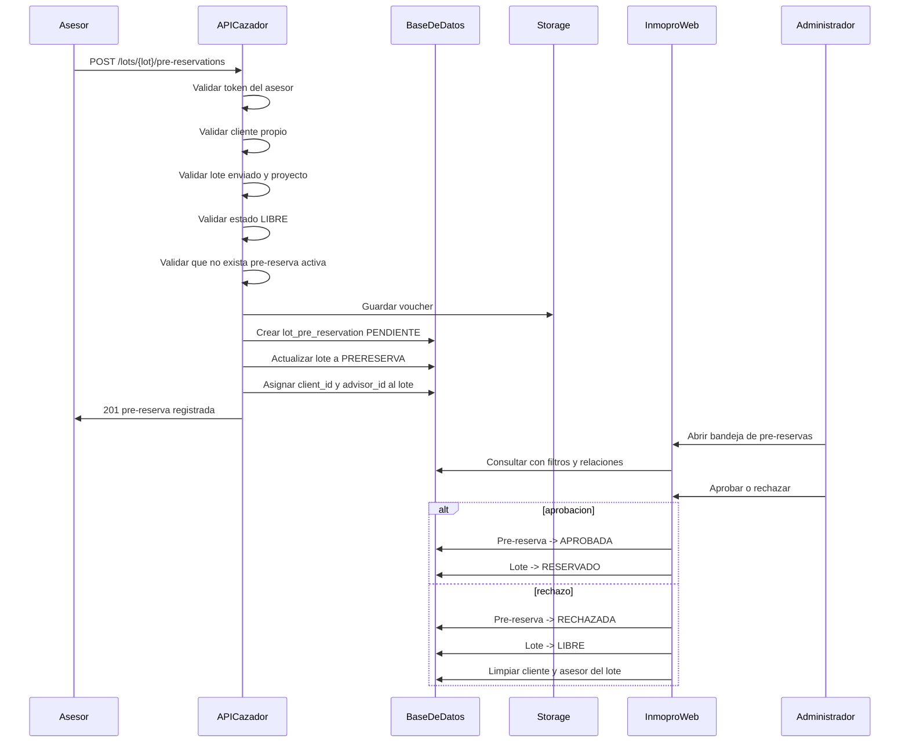

---

## 4. Flujo actual de transferencia con aprobacion posterior

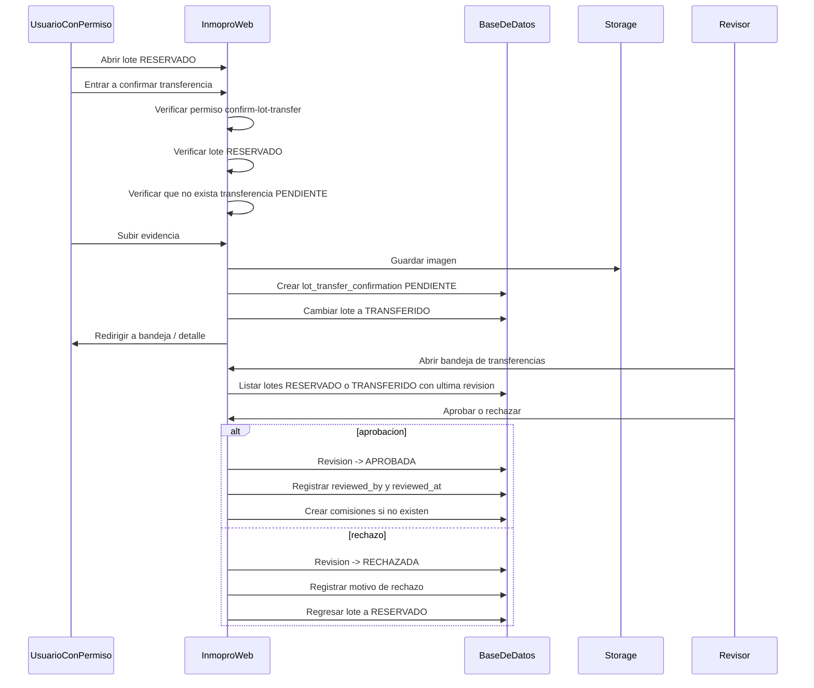

---

## 5. Doble estado del lote y de la revision de transferencia

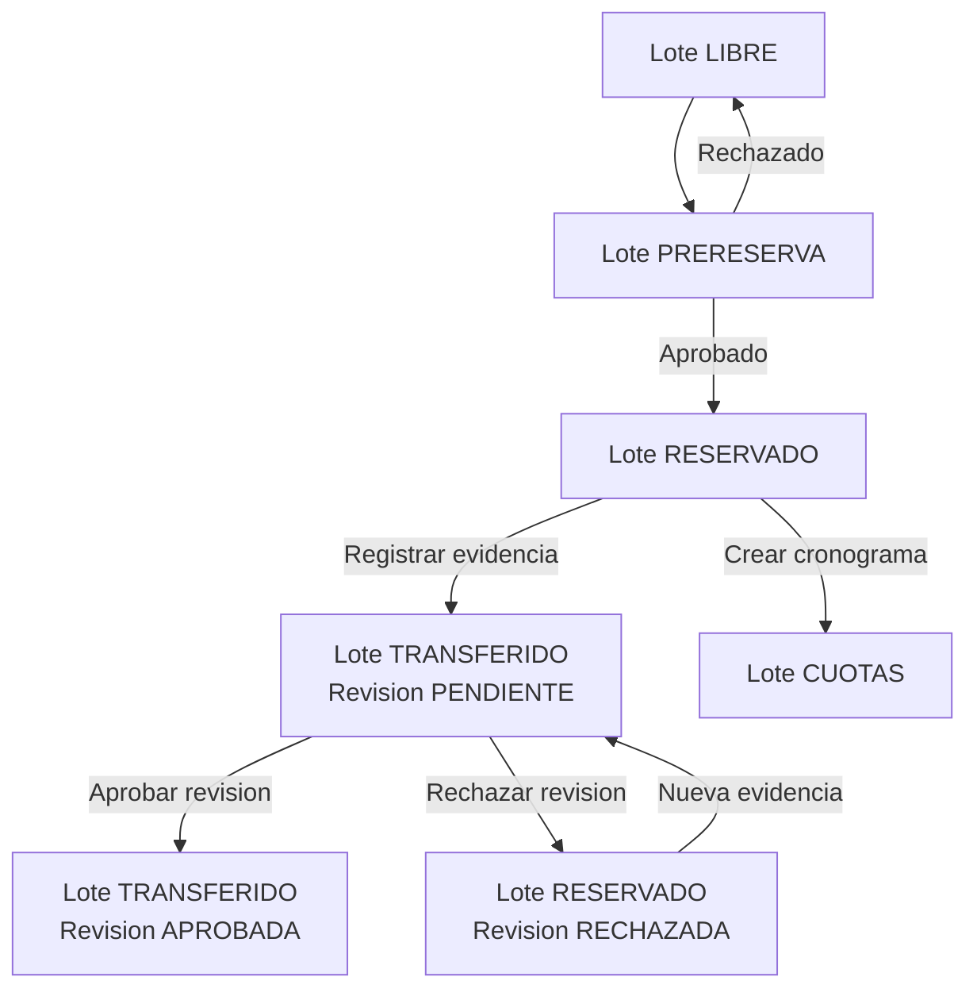

---

## 6. Mapa de estados del lote con puntos de control

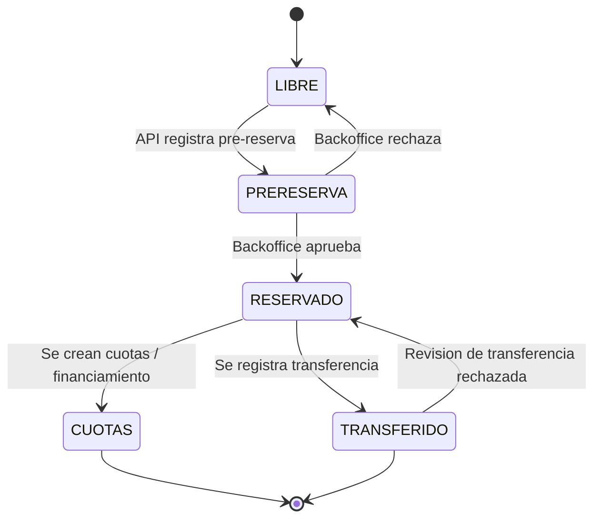

---

## 7. Cobranza y cuentas por cobrar por lote

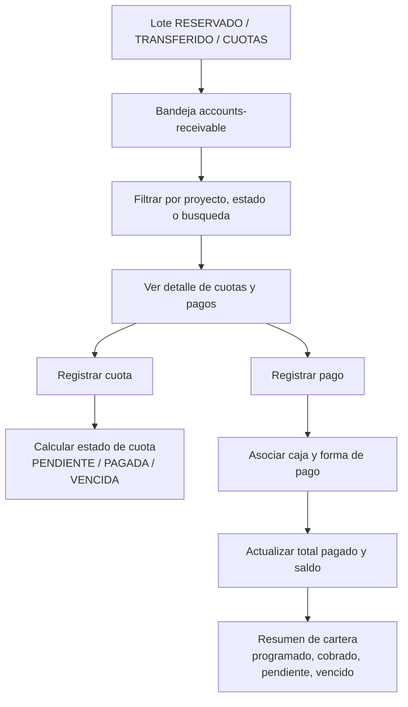

---

## 8. Flujo de comisiones a partir de transferencias aprobadas

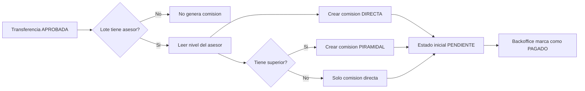

---

## 9. Ciclo de clientes en backoffice y Excel

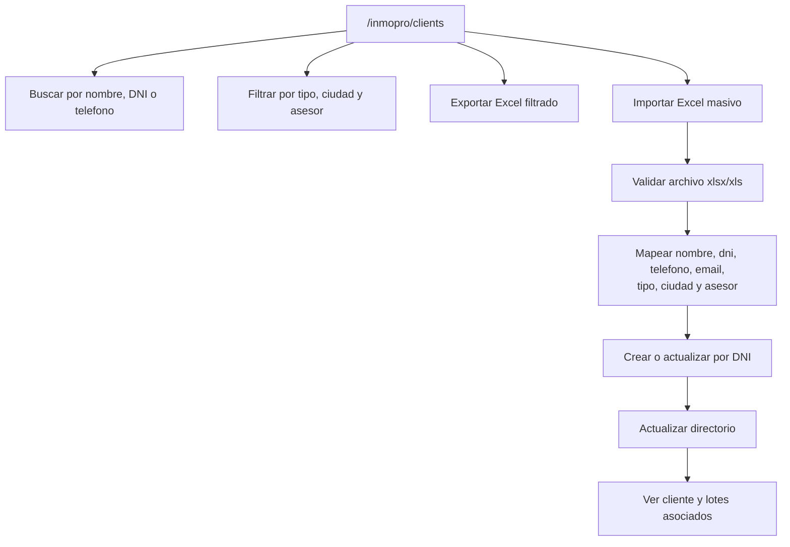

---

## 10. Flujo de membresias de asesores

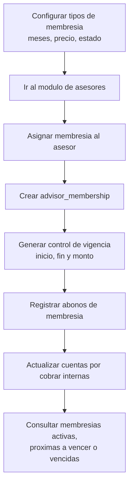

---

## 11. Tickets de atencion y firma de escritura

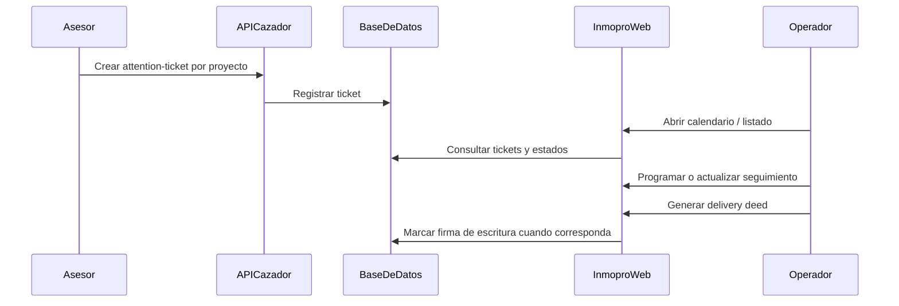

---

## 12. Caja, bancos y movimientos operativos

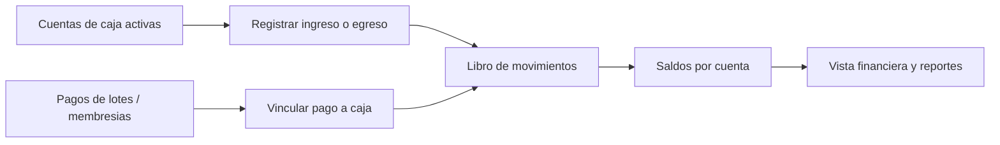

---

## 13. Vista ejecutiva de modulos Inmopro

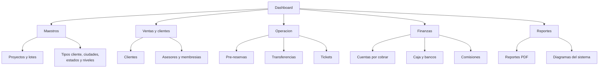

---

## 14. Resumen actualizado de rutas por proceso

| Proceso | Canal | Rutas principales |
|---------|-------|-------------------|
| Login vendedor | API | `POST /api/v1/cazador/auth/login` |
| Perfil vendedor | API | `GET/PUT /me`, `PUT /me/pin` |
| Clientes del asesor | API | `GET/POST /clients`, `GET/PUT /clients/{id}` |
| Tickets del asesor | API | `GET/POST /attention-tickets`, `POST /attention-tickets/{id}/cancel` |
| Catalogo de proyectos y lotes | API | `GET /projects`, `GET /projects/{id}`, `GET /lots`, `GET /lots/{id}` |
| Pre-reserva | API | `POST /lots/{lot}/pre-reservations` |
| Directorio de clientes | Web | `/inmopro/clients`, `GET /clients/export-excel`, `POST /clients/import-from-excel` |
| Inventario y detalle de lote | Web | `/inmopro/lots`, `GET /lots/{id}`, `GET /lots/export-pdf` |
| Pre-reservas backoffice | Web | `/inmopro/lot-pre-reservations`, `POST /approve`, `POST /reject` |
| Transferencias | Web | `/inmopro/lot-transfer-confirmations`, `GET/POST /inmopro/lots/{id}/transfer-confirmation`, `POST /approve`, `POST /reject` |
| Cobranza | Web | `/inmopro/accounts-receivable`, `POST /lots/{lot}/installments`, `POST /lots/{lot}/payments` |
| Caja y bancos | Web | `/inmopro/cash-accounts`, `POST /cash-accounts`, `POST /cash-accounts/{id}/entries` |
| Comisiones | Web | `/inmopro/commissions`, `POST /commissions/{id}/mark-as-paid` |
| Membresias | Web | `/inmopro/advisor-memberships`, `POST /advisor-memberships/{id}/payments` |
| Tickets de atencion admin | Web | `/inmopro/attention-tickets`, calendario, delivery deed, firma |
| Reportes y diagramas | Web | `/inmopro/reports`, `/inmopro/reports/pdf`, `/inmopro/process-diagrams` |

---

Para generar una imagen a partir de un diagrama Mermaid se puede usar [mermaid.live](https://mermaid.live) o la extensión Mermaid en VS Code / Cursor.
