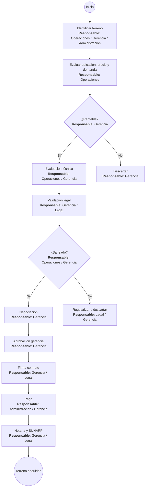
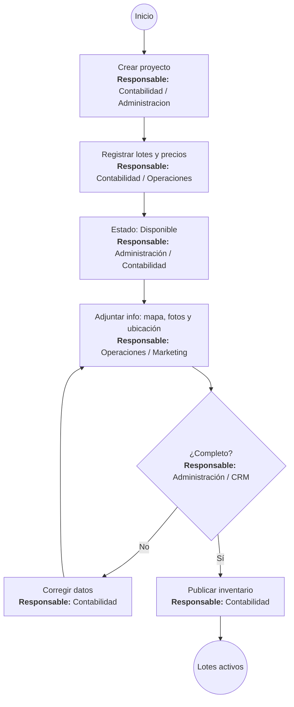
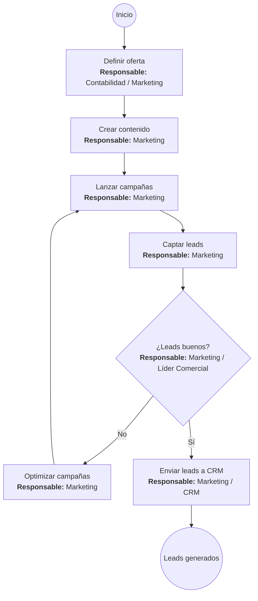
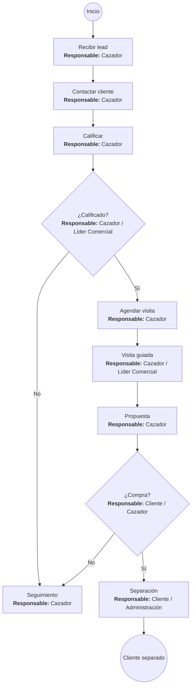
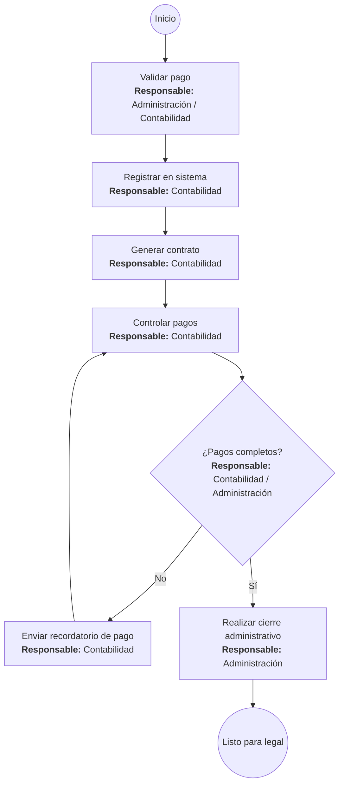
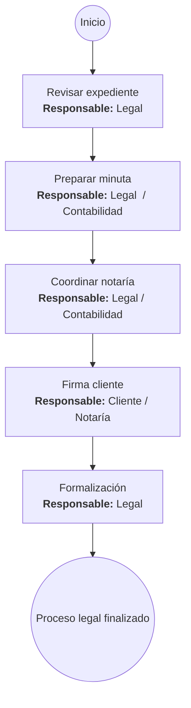
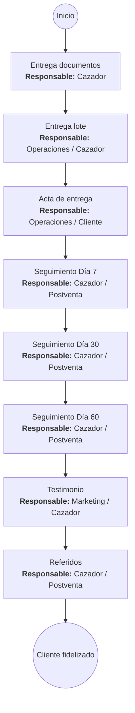

# Flujos por áreas – Lotes en Remate (con responsables)

## 1. Compra de terrenos para lotizar

## 2. Registro de lotes en CRM

## 3. Marketing

## 4. Ventas (Cazadores)

## 5. Administración / Caja

## 6. Legal / Notaría

## 7. Postventa

